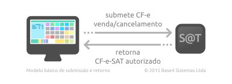

.. _exemplos-documentos-xml:

Exemplos de Documentos
======================

Abaixo estão relacionados documentos CF-e que formam um ciclo completo, desde o
XML de venda gerado pelo aplicativo comercial e seu retorno autorizado pelo
equipamento SAT e o seu subsequente cancelamento.

.. _exemplos-xml-do-cfe-de-venda:

XML do CF-e de Venda
--------------------

O seguinte documento XML representa um CF-e de venda pronto para ser enviado ao
equipamento SAT. Um documento como este pode ser criado como visto em
:ref:`criando-um-cfe-de-venda` e submetido às funções SAT
:meth:`~satcfe.base.FuncoesSAT.enviar_dados_venda` e/ou
:meth:`~satcfe.base.FuncoesSAT.teste_fim_a_fim`.

.. sourcecode:: xml

    <?xml version="1.0"?>
    <CFe>
      <infCFe versaoDadosEnt="0.07">
        <ide>
          <CNPJ>08427847000169</CNPJ>
          <signAC>SGR-SAT SISTEMA DE GESTAO E RETAGUARDA DO SAT</signAC>
          <numeroCaixa>001</numeroCaixa>
        </ide>
        <emit>
          <CNPJ>61099008000141</CNPJ>
          <IE>111111111111</IE>
          <IM>12345</IM>
          <cRegTribISSQN>3</cRegTribISSQN>
          <indRatISSQN>N</indRatISSQN>
        </emit>
        <dest/>
        <det nItem="1">
          <prod>
            <cProd>116</cProd>
            <cEAN>9990000001163</cEAN>
            <xProd>Cascao</xProd>
            <CFOP>5405</CFOP>
            <uCom>UN</uCom>
            <qCom>1.0000</qCom>
            <vUnCom>4.00</vUnCom>
            <indRegra>A</indRegra>
          </prod>
          <imposto>
            <ICMS>
              <ICMSSN102>
                <Orig>0</Orig>
                <CSOSN>500</CSOSN>
              </ICMSSN102>
            </ICMS>
            <PIS>
              <PISSN>
                <CST>49</CST>
              </PISSN>
            </PIS>
            <COFINS>
              <COFINSSN>
                <CST>49</CST>
              </COFINSSN>
            </COFINS>
          </imposto>
        </det>
        <total/>
        <pgto>
          <MP>
            <cMP>01</cMP>
            <vMP>4.00</vMP>
          </MP>
        </pgto>
      </infCFe>
    </CFe>

.. _exemplos-xml-do-cfe-sat-venda:

XML do CF-e-SAT de Venda
------------------------

O seguinte documento XML **seria um documento fiscal com validade jurídica** se
não tivesse sido **emitido contra um equipamento SAT para desenvolvimento** [#f1]_.
Repare que o emitente possui os dados do fabricante do equipamento além de
vários outros elementos importantes que foram adicionados pelo equipamento, tais
como o valor do troco e o bloco de assinatura no final do documento.

.. sourcecode:: xml

    <?xml version="1.0"?>
    <CFe>
      <infCFe Id="CFe35161261099008000141599000026310003024947916" versao="0.07" versaoDadosEnt="0.07" versaoSB="010300">
        <ide>
          <cUF>35</cUF>
          <cNF>494791</cNF>
          <mod>59</mod>
          <nserieSAT>900002631</nserieSAT>
          <nCFe>000302</nCFe>
          <dEmi>20161220</dEmi>
          <hEmi>095111</hEmi>
          <cDV>6</cDV>
          <tpAmb>2</tpAmb>
          <CNPJ>08427847000169</CNPJ>
          <signAC>SGR-SAT SISTEMA DE GESTAO E RETAGUARDA DO SAT</signAC>
          <assinaturaQRCODE>EKP6q5FOMSxPfTr4yf2LHBw4UTp6vsFsJ6cM3c6Lc0AjLExZ63tERLucVgp5Ao69fzmS103/PiTyw2XdweVebq1hfLiK7vbPRqgVWJySxjcLUCzMJacVlPCJyOwTxDL34tyvbW6Vr+c2+jBB3HsqO3zxW9ZsrzBWhhkxx9zWgFC6CSf5wOZe88+cTU+JVpWN6pPUEKIoeO3Z0/1+WZz1ESoU+kGfpVu+z45j70AZu0bIRjFT6bqs65BUDtUKRtMsq72vocnSD9yQgYHwNpZglCGkREyF2qQu18oqN0RQvi9L8DBSFhxf8QW2RC13XpqfmLWwFXc8sjp1VjjgDH6CYQ==</assinaturaQRCODE>
          <numeroCaixa>001</numeroCaixa>
        </ide>
        <emit>
          <CNPJ>61099008000141</CNPJ>
          <xNome>DIMAS DE MELO PIMENTA SISTEMAS DE PONTO E ACESSO LTDA</xNome>
          <xFant>DIMEP</xFant>
          <enderEmit>
            <xLgr>AVENIDA MOFARREJ</xLgr>
            <nro>840</nro>
            <xCpl>908</xCpl>
            <xBairro>VL. LEOPOLDINA</xBairro>
            <xMun>SAO PAULO</xMun>
            <CEP>05311000</CEP>
          </enderEmit>
          <IE>111111111111</IE>
          <IM>12345</IM>
          <cRegTrib>3</cRegTrib>
          <cRegTribISSQN>3</cRegTribISSQN>
          <indRatISSQN>N</indRatISSQN>
        </emit>
        <dest/>
        <det nItem="1">
          <prod>
            <cProd>116</cProd>
            <cEAN>9990000001163</cEAN>
            <xProd>Cascao</xProd>
            <CFOP>5405</CFOP>
            <uCom>UN</uCom>
            <qCom>1.0000</qCom>
            <vUnCom>4.00</vUnCom>
            <vProd>4.00</vProd>
            <indRegra>A</indRegra>
            <vItem>4.00</vItem>
          </prod>
          <imposto>
            <ICMS>
              <ICMSSN102>
                <Orig>0</Orig>
                <CSOSN>500</CSOSN>
              </ICMSSN102>
            </ICMS>
            <PIS>
              <PISSN>
                <CST>49</CST>
              </PISSN>
            </PIS>
            <COFINS>
              <COFINSSN>
                <CST>49</CST>
              </COFINSSN>
            </COFINS>
          </imposto>
        </det>
        <total>
          <ICMSTot>
            <vICMS>0.00</vICMS>
            <vProd>4.00</vProd>
            <vDesc>0.00</vDesc>
            <vPIS>0.00</vPIS>
            <vCOFINS>0.00</vCOFINS>
            <vPISST>0.00</vPISST>
            <vCOFINSST>0.00</vCOFINSST>
            <vOutro>0.00</vOutro>
          </ICMSTot>
          <vCFe>4.00</vCFe>
        </total>
        <pgto>
          <MP>
            <cMP>01</cMP>
            <vMP>4.00</vMP>
          </MP>
          <vTroco>0.00</vTroco>
        </pgto>
      </infCFe>
      <Signature xmlns="http://www.w3.org/2000/09/xmldsig#">
        <SignedInfo>
          <CanonicalizationMethod Algorithm="http://www.w3.org/TR/2001/REC-xml-c14n-20010315"/>
          <SignatureMethod Algorithm="http://www.w3.org/2001/04/xmldsig-more#rsa-sha256"/>
          <Reference URI="#CFe35161261099008000141599000026310003024947916">
            <Transforms>
              <Transform Algorithm="http://www.w3.org/2000/09/xmldsig#enveloped-signature"/>
              <Transform Algorithm="http://www.w3.org/TR/2001/REC-xml-c14n-20010315"/>
            </Transforms>
            <DigestMethod Algorithm="http://www.w3.org/2001/04/xmlenc#sha256"/>
            <DigestValue>3sW0ay6BB4wbJUVnp9B1SQpqCka+ga8gwxHy/ViCXuw=</DigestValue>
          </Reference>
        </SignedInfo>
        <SignatureValue>G9hWhCmhaFn4FYNU+ukYm4a8OfvFR5fZz9CYGj0XN5ayr43p2ugho7oCY1ySlwhrl0dTfnvQrE6S1IvD/W7LcS8PSnCx4G7X4wzZpTQojDAwbAZBBHjEe4Xhj7gIHRKhHvwiHwBsuBF64zZgUCcs91SgVJNFc1pfor/RP37pfwfFNQtobhvvFak99J0aPsHsmYoPeQBH2HzrmGfqLvZvpZQX7xJlpgU/D/wPxWpSTjHUOr2UegT0LYMPudpUQ96rBLgByvwx2rkJ+fmXz94T9WNPQxRyhJduDjChCFkwqFZ+3Ik4+s3LiQDVM/MonHvXB9BPIYRJOjiN3C6Nc3WMSA==</SignatureValue>
        <KeyInfo>
          <X509Data>
            <X509Certificate>MIIG7zCCBNegAwIBAgIQPYgMyeNxYCOCHVsMXFBvODANBgkqhkiG9w0BAQsFADBnMQswCQYDVQQGEwJCUjE1MDMGA1UEChMsU2VjcmV0YXJpYSBkYSBGYXplbmRhIGRvIEVzdGFkbyBkZSBTYW8gUGF1bG8xITAfBgNVBAMTGEFDIFNBVCBkZSBUZXN0ZSBTRUZBWiBTUDAeFw0xNTA0MjkwMDAwMDBaFw0yMDA0MjYyMzU5NTlaMIHsMQswCQYDVQQGEwJCUjESMBAGA1UECBMJU2FvIFBhdWxvMREwDwYDVQQKFAhTRUZBWi1TUDEPMA0GA1UECxQGQUMtU0FUMSgwJgYDVQQLFB9BdXRlbnRpY2FkbyBwb3IgQVIgU0VGQVogU1AgU0FUMRwwGgYDVQQLFBMxNDMwMzM3MzM1MTQ3NTExNjUxMRIwEAYDVQQFEwk5MDAwMDI2MzExSTBHBgNVBAMTQERJTUFTIERFIE1FTE8gUElNRU5UQSBTSVNURU1BUyBERSBQT05UTyBFIEFDRVNTTyA6NjEwOTkwMDgwMDAxNDEwggEiMA0GCSqGSIb3DQEBAQUAA4IBDwAwggEKAoIBAQCC9Suy7jPw4ahFJem/Sg4cOokkV7WYxRjxFLNJEnFb3n31kmhlqICAAYRTazeJuaR/qkuvc5MjyVmI5cMR+GWhvrOK7Dm4y8kpMyJ/Kqo8A887jUlqpUs4aJ+TwUnK0w8Hf7SUYofwteKPlfXsEHbpn3kJHVoUyNMnIu8nkqdlhnYXWwPBbn56Xc2aZgJS4IQFd/z/C4T01KC5f31jehZTc+ColHsvG6xgH9dEx9Bk9NVaPBMYBuNNOJOEOWw+Lh1cc8Jn1UOOOTDyiOy8vfzCVIeMRVncY1mKFtHy4DmIXg+1dYgYLaEYd3WQxtq1AXuPk9cDfZw3hXbBkp6lH7HHAgMBAAGjggIPMIICCzAkBgNVHREEHTAboBkGBWBMAQMDoBAEDjYxMDk5MDA4MDAwMTQxMAkGA1UdEwQCMAAwDgYDVR0PAQH/BAQDAgXgMB8GA1UdIwQYMBaAFI45QQBc8rgF2qhtmLkBRm1uY98CMGsGA1UdHwRkMGIwYKBeoFyGWmh0dHA6Ly9hY3NhdC10ZXN0ZS5pbXByZW5zYW9maWNpYWwuY29tLmJyL3JlcG9zaXRvcmlvL2xjci9hY3NhdHNlZmF6c3AvYWNzYXRzZWZhenNwY3JsLmNybDB7BgNVHSAEdDByMHAGCSsGAQQBgewtAzBjMGEGCCsGAQUFBwIBFlVodHRwOi8vYWNzYXQuaW1wcmVuc2FvZmljaWFsLmNvbS5ici9yZXBvc2l0b3Jpby9kcGMvYWNzYXRzZWZhenNwL2RwY19hY3NhdHNlZmF6c3AucGRmMBMGA1UdJQQMMAoGCCsGAQUFBwMCMIGnBggrBgEFBQcBAQSBmjCBlzBfBggrBgEFBQcwAoZTaHR0cHM6Ly9hY3NhdC10ZXN0ZS5pbXByZW5zYW9maWNpYWwuY29tLmJyL3JlcG9zaXRvcmlvL2NlcnRpZmljYWRvcy9hY3NhdC10ZXN0ZS5wN2MwNAYIKwYBBQUHMAGGKGh0dHA6Ly9vY3NwLXBpbG90LmltcHJlbnNhb2ZpY2lhbC5jb20uYnIwDQYJKoZIhvcNAQELBQADggIBAMPeBgVj5JdK7Zy0fzLVUXuJB5HLWXmziimAn7QOEzg/1Mjqi0+SV82g2mf7gbKNvEV9w5gKrTGw6rkTTYf5HpqPtb3KNxsCeKpAfkdupT8WkRM9FANfW0kPH2adHdcNOdEfEiSmOIjFVnTDfoIcb83LCGxqtaNGOlEzvkTSGpJjYOgP8GXXBdE/eTVbzflwqhBpAXzyYWN2bCZDqlFNAhib1vIe/cz8i6OHYrXk602qw4vnAcOpB0rlHtZCXIUiCZCanBjdn5PmSZVh88bzpJd3ltMd116YFAyShSJXCi8SqOLRVzQXkXvbL0iUqg6TO2gMCqRfin7prc/mCvTQCuuDq4EGljXW1FAy8rS732r4BKzJ7xWo5BGZKZp4jANo62cECSJhApwzQBnfiDWil353rtxGUweTP92dJGcGraiLHP7wuil+ucQSlZOpEmrmGMIZYWqdlh6ubBIAIMz+7Q5fxF5Wkr/hRAUiDpliiQZaBaXsKxVk4uxFKn7/86BB4GTqTQMW4XXzE6hG4PhwriPiG9cPYDt68hR2LK1vHZXzBc6P3QxGlh/rdiJMpzt6RY5luEciP1+LI8YCZVIvqY0YZwoCG3vVkDYwpNpHnlZVct2ugYBCd9cDgXRUD3kO0GU2P+xnaiAMfsLSo3JhfXzi5fU48KjmZRi6xGot+08s</X509Certificate>
          </X509Data>
        </KeyInfo>
      </Signature>
    </CFe>

.. _exemplos-xml-do-cfe-de-cancelamento:

XML do CF-e de Cancelamento
---------------------------

O seguinte documento XML representa um CF-e de cancelamento pronto para ser
enviado ao equipamento SAT. Um documento como este pode ser criado como visto
em :ref:`criando-um-cfe-de-cancelamento` e submetido à função SAT
:meth:`~satcfe.base.FuncoesSAT.cancelar_ultima_venda`.

.. sourcecode:: xml

    <?xml version="1.0"?>
    <CFeCanc>
      <infCFe chCanc="CFe35161261099008000141599000026310003024947916">
        <ide>
          <CNPJ>08427847000169</CNPJ>
          <signAC>SGR-SAT SISTEMA DE GESTAO E RETAGUARDA DO SAT</signAC>
          <numeroCaixa>001</numeroCaixa>
        </ide>
        <emit/>
        <dest/>
        <total/>
      </infCFe>
    </CFeCanc>

.. _exemplos-xml-do-cfe-sat-cancelamento:

XML do CF-e-SAT de Cancelamento
-------------------------------

O seguinte documento XML **seria um documento fiscal com validade jurídica** se
não tivesse sido **emitido contra um equipamento SAT para desenvolvimento**.
Repare que o equipamento SAT adiciona vários outros elementos ao documento
antes de assiná-lo e enviá-lo à SEFAZ.

.. sourcecode:: xml

    <?xml version="1.0"?>
    <CFeCanc>
      <infCFe Id="CFe35161261099008000141599000026310003038725260" chCanc="CFe35161261099008000141599000026310003024947916" versao="0.07">
        <dEmi>20161220</dEmi>
        <hEmi>095111</hEmi>
        <ide>
          <cUF>35</cUF>
          <cNF>872526</cNF>
          <mod>59</mod>
          <nserieSAT>900002631</nserieSAT>
          <nCFe>000303</nCFe>
          <dEmi>20161220</dEmi>
          <hEmi>095203</hEmi>
          <cDV>0</cDV>
          <CNPJ>08427847000169</CNPJ>
          <signAC>SGR-SAT SISTEMA DE GESTAO E RETAGUARDA DO SAT</signAC>
          <assinaturaQRCODE>XbWIYJSkzTJyixs9ZHOn07dUFuxFFZYAd/slcOj2WjTUqwDHVAYk5v2efko6/0tE3rtEJ3Zm1vAyoXeG12i+OYJaykoGzUdyTtSkwZdT1FnPoOkHzPipR+Be7GmaxYBkWD/ytoGd6bApFvlWbxOGqmW1Ngo4mIr4Rn14TL31tGXz4HAuTCnIP/bKkQlJ8R1d1+4SB06DbEM/8QC3mFLzKTH2T7rEtqF7KTLdIrovzyeIAL6ci6AebB/wpna9KcfWiC2zoAc0rsp08zQUe5B+8kE6KPjPWvQkSOndhIdxLOt45v7rsl72J0qjIVzSSCkj3UtCitAmorkrfCtKTWi/WA==</assinaturaQRCODE>
          <numeroCaixa>001</numeroCaixa>
        </ide>
        <emit>
          <CNPJ>61099008000141</CNPJ>
          <xNome>DIMAS DE MELO PIMENTA SISTEMAS DE PONTO E ACESSO LTDA</xNome>
          <xFant>DIMEP</xFant>
          <enderEmit>
            <xLgr>AVENIDA MOFARREJ</xLgr>
            <nro>840</nro>
            <xCpl>908</xCpl>
            <xBairro>VL. LEOPOLDINA</xBairro>
            <xMun>SAO PAULO</xMun>
            <CEP>05311000</CEP>
          </enderEmit>
          <IE>111111111111</IE>
          <IM>12345</IM>
        </emit>
        <dest/>
        <total>
          <vCFe>4.00</vCFe>
        </total>
      </infCFe>
      <Signature xmlns="http://www.w3.org/2000/09/xmldsig#">
        <SignedInfo>
          <CanonicalizationMethod Algorithm="http://www.w3.org/TR/2001/REC-xml-c14n-20010315"/>
          <SignatureMethod Algorithm="http://www.w3.org/2001/04/xmldsig-more#rsa-sha256"/>
          <Reference URI="#CFe35161261099008000141599000026310003038725260">
            <Transforms>
              <Transform Algorithm="http://www.w3.org/2000/09/xmldsig#enveloped-signature"/>
              <Transform Algorithm="http://www.w3.org/TR/2001/REC-xml-c14n-20010315"/>
            </Transforms>
            <DigestMethod Algorithm="http://www.w3.org/2001/04/xmlenc#sha256"/>
            <DigestValue>tzvG+236ZjAEMmwraPQoLGEBXNYJ3YAWoJ+5C4NXzdc=</DigestValue>
          </Reference>
        </SignedInfo>
        <SignatureValue>ciPsCbdN8RHYJ13BqkYY+IiR3DePjCfehK8XBukyMvCsBVkNrM++nQyIgTWeAXhYuCWFsoX3BHlGLAvHQPG1xqnynqh2UFQmgxuh32mHUyJu/Q4HF9OYzA6frylWMSfmZzqM64DHmXhhDr2YAggFneRDdBZy9qOYAewZux96vbeqHNrc0SHTmmWwDjn4DkeFe5aOxgT8u1tMVQIJWqygbWwrXW4wYb3Ool2JPJt7DIyvgpYbCGuokiB6w9Ewv/fHT8KK+S84lM02md/woEld4hI5B7lRb9mCWWR5T5OIx7JYqSkQtMc+vNRN+N/XkuWtq21EWRTnhgk3oAewOg+gBw==</SignatureValue>
        <KeyInfo>
          <X509Data>
            <X509Certificate>MIIG7zCCBNegAwIBAgIQPYgMyeNxYCOCHVsMXFBvODANBgkqhkiG9w0BAQsFADBnMQswCQYDVQQGEwJCUjE1MDMGA1UEChMsU2VjcmV0YXJpYSBkYSBGYXplbmRhIGRvIEVzdGFkbyBkZSBTYW8gUGF1bG8xITAfBgNVBAMTGEFDIFNBVCBkZSBUZXN0ZSBTRUZBWiBTUDAeFw0xNTA0MjkwMDAwMDBaFw0yMDA0MjYyMzU5NTlaMIHsMQswCQYDVQQGEwJCUjESMBAGA1UECBMJU2FvIFBhdWxvMREwDwYDVQQKFAhTRUZBWi1TUDEPMA0GA1UECxQGQUMtU0FUMSgwJgYDVQQLFB9BdXRlbnRpY2FkbyBwb3IgQVIgU0VGQVogU1AgU0FUMRwwGgYDVQQLFBMxNDMwMzM3MzM1MTQ3NTExNjUxMRIwEAYDVQQFEwk5MDAwMDI2MzExSTBHBgNVBAMTQERJTUFTIERFIE1FTE8gUElNRU5UQSBTSVNURU1BUyBERSBQT05UTyBFIEFDRVNTTyA6NjEwOTkwMDgwMDAxNDEwggEiMA0GCSqGSIb3DQEBAQUAA4IBDwAwggEKAoIBAQCC9Suy7jPw4ahFJem/Sg4cOokkV7WYxRjxFLNJEnFb3n31kmhlqICAAYRTazeJuaR/qkuvc5MjyVmI5cMR+GWhvrOK7Dm4y8kpMyJ/Kqo8A887jUlqpUs4aJ+TwUnK0w8Hf7SUYofwteKPlfXsEHbpn3kJHVoUyNMnIu8nkqdlhnYXWwPBbn56Xc2aZgJS4IQFd/z/C4T01KC5f31jehZTc+ColHsvG6xgH9dEx9Bk9NVaPBMYBuNNOJOEOWw+Lh1cc8Jn1UOOOTDyiOy8vfzCVIeMRVncY1mKFtHy4DmIXg+1dYgYLaEYd3WQxtq1AXuPk9cDfZw3hXbBkp6lH7HHAgMBAAGjggIPMIICCzAkBgNVHREEHTAboBkGBWBMAQMDoBAEDjYxMDk5MDA4MDAwMTQxMAkGA1UdEwQCMAAwDgYDVR0PAQH/BAQDAgXgMB8GA1UdIwQYMBaAFI45QQBc8rgF2qhtmLkBRm1uY98CMGsGA1UdHwRkMGIwYKBeoFyGWmh0dHA6Ly9hY3NhdC10ZXN0ZS5pbXByZW5zYW9maWNpYWwuY29tLmJyL3JlcG9zaXRvcmlvL2xjci9hY3NhdHNlZmF6c3AvYWNzYXRzZWZhenNwY3JsLmNybDB7BgNVHSAEdDByMHAGCSsGAQQBgewtAzBjMGEGCCsGAQUFBwIBFlVodHRwOi8vYWNzYXQuaW1wcmVuc2FvZmljaWFsLmNvbS5ici9yZXBvc2l0b3Jpby9kcGMvYWNzYXRzZWZhenNwL2RwY19hY3NhdHNlZmF6c3AucGRmMBMGA1UdJQQMMAoGCCsGAQUFBwMCMIGnBggrBgEFBQcBAQSBmjCBlzBfBggrBgEFBQcwAoZTaHR0cHM6Ly9hY3NhdC10ZXN0ZS5pbXByZW5zYW9maWNpYWwuY29tLmJyL3JlcG9zaXRvcmlvL2NlcnRpZmljYWRvcy9hY3NhdC10ZXN0ZS5wN2MwNAYIKwYBBQUHMAGGKGh0dHA6Ly9vY3NwLXBpbG90LmltcHJlbnNhb2ZpY2lhbC5jb20uYnIwDQYJKoZIhvcNAQELBQADggIBAMPeBgVj5JdK7Zy0fzLVUXuJB5HLWXmziimAn7QOEzg/1Mjqi0+SV82g2mf7gbKNvEV9w5gKrTGw6rkTTYf5HpqPtb3KNxsCeKpAfkdupT8WkRM9FANfW0kPH2adHdcNOdEfEiSmOIjFVnTDfoIcb83LCGxqtaNGOlEzvkTSGpJjYOgP8GXXBdE/eTVbzflwqhBpAXzyYWN2bCZDqlFNAhib1vIe/cz8i6OHYrXk602qw4vnAcOpB0rlHtZCXIUiCZCanBjdn5PmSZVh88bzpJd3ltMd116YFAyShSJXCi8SqOLRVzQXkXvbL0iUqg6TO2gMCqRfin7prc/mCvTQCuuDq4EGljXW1FAy8rS732r4BKzJ7xWo5BGZKZp4jANo62cECSJhApwzQBnfiDWil353rtxGUweTP92dJGcGraiLHP7wuil+ucQSlZOpEmrmGMIZYWqdlh6ubBIAIMz+7Q5fxF5Wkr/hRAUiDpliiQZaBaXsKxVk4uxFKn7/86BB4GTqTQMW4XXzE6hG4PhwriPiG9cPYDt68hR2LK1vHZXzBc6P3QxGlh/rdiJMpzt6RY5luEciP1+LI8YCZVIvqY0YZwoCG3vVkDYwpNpHnlZVct2ugYBCd9cDgXRUD3kO0GU2P+xnaiAMfsLSo3JhfXzi5fU48KjmZRi6xGot+08s</X509Certificate>
          </X509Data>
        </KeyInfo>
      </Signature>
    </CFeCanc>

.. rubric:: Notas

.. [#f1] Também são chamados de "kit SAT".
