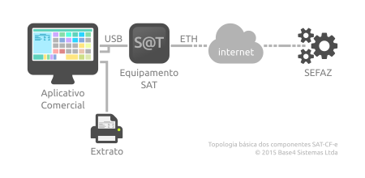

..
    SATCFe documentation master file
    Created by sphinx-quickstart on Wed Jun 24 19:12:11 2015.

Projeto SATCFe
==============

A Secretaria da Fazenda do Estado de São Paulo, `SEFAZ/SP`_, implantou através
da `Portaria CAT 147`_ o `SAT-CF-e <http://www.fazenda.sp.gov.br/sat>`_ (Sistema
de Autorização e Transmissão de Cupons Fiscais eletrônicos), em substituição às
impressoras fiscais (ECF).

Esta documentação diz respeito ao projeto `SATCFe`_ desenvolvido pela Base4
Sistemas Ltda com o objetivo de abstrair o acesso ao Equipamento SAT através da
linguagem `Python`_, tornando trivial o acesso às funções da biblioteca SAT,
resultando em respostas prontas para serem utilizadas pela aplicação cliente,
normalmente um software de ponto-de-venda (PDV).

A figura abaixo ilustra a topologia básica do SAT-CF-e no estabelecimento
comercial. Em uma operação típica, o aplicativo comercial envia o CF-e de venda
para o equipamento SAT que irá completar, validar, assinar e transmitir o
documento para a SEFAZ para autorização. Se o documento for autorizado ele será
devolvido para o aplicativo comercial que irá emitir o extrato do CF-e para o
consumidor.

Na maioria das vezes, a aplicação cliente acessa as funções da biblioteca SAT
para transmitir à SEFAZ os dados de uma venda, o CF-e de venda, ou para cancelar
o último CF-e transmitido. Além disso, a biblioteca SAT contém várias outras
funções que possibilitam a execução de tarefas administrativas e de
configurações do equipamento SAT. Todas essas funções serão detalhadas uma-a-uma
nesta documentação.

Projetos Relacionados
---------------------

Este projeto é apenas uma parte de um total de cinco projetos que compõem uma
solução compreensível para a tecnologia SAT-CF-e em linguagem Python,
disponíveis para integração nas aplicações de ponto-de-venda. São eles:

* Projeto `SATComum`_
    Mantém o código que é compartilhado pelos outros projetos relacionados,
    tais como validação, formatação e valores constantes.

* Projeto `SATHub`_
    Torna possível o compartilhamento de equipamentos SAT com múltiplos pontos-
    de-venda, além de tornar possível que aplicações heterogêneas, escritas em
    outras linguagens de programação ou de outras plataformas, acessem o
    equipamento SAT.

* Projeto `SATExtrato`_
    Impressão dos extratos do CF-e-SAT. Este projeto é capaz de imprimir
    extratos de documentos de venda ou de cancelamento diretamente a partir dos
    documentos XML que os representam. A impressão tem um alto grau de
    compatibilidade com mini-impressoras (conhecidas como impressoras
    não-fiscais) já que é baseada na tecnologia Epson |copy| ESC/POS |reg|
    através do projeto **PyESCPOS**.

* Projeto `PyESCPOS`_
    Implementa o suporte à tecnologia Epson |copy| ESC/POS |reg| compatível com
    a imensa maioria das mini-impressoras disponíveis no mercado.

Participe
---------

Participe deste projeto ou de qualquer um dos projetos relacionados. Se você for
capaz de contribuir com código, excelente! Faça um clone do repositório,
modifique o que acha que deve e faça o *pull-request*. Teremos
`prazer <https://www.python.org/dev/peps/pep-0008/>`_ em
`aceitar <http://docs.python-guide.org/en/latest/writing/style/>`_ o seu
`código <http://python.net/~goodger/projects/pycon/2007/idiomatic/handout.html>`_.

Se você não quer (ou não pode) programar, também pode contribuir com
documentação. Ou ainda, se você vir algo errado ou achar que algo não está
certo, `conte pra gente <https://github.com/base4sistemas/satcfe/issues>`_.

Siga-nos no `Github <https://github.com/base4sistemas>`_ ou no
`Twitter <https://twitter.com/base4sistemas>`_.

Conteúdo
========

.. toctree::
   :maxdepth: 2

   basico
   cliente
   funcoes
   venda_cancelamento
   exemplos
   api

Tabelas e Índices
==================

* :ref:`genindex`
* :ref:`modindex`
* :ref:`search`

Glossário
=========

.. glossary::

    SAT-CF-e
        Diz respeito à tecnologia SAT-Fiscal e toda a infraestrutura, física e
        lógica, usada na transmissão de documentos fiscais (CF-e) de venda e/ou
        cancelamento. Visite a página da `Secretaria da Fazenda de São Paulo <http://www.fazenda.sp.gov.br/sat>`_
        para outras informações.

    CF-e
    CF-e de Venda
    CF-e de Cancelamento
        Cupom Fiscal eletrônico, um documento em formato XML que descreve uma
        transação de venda ao consumidor ou o cancelamento de uma venda
        anterior. O **CF-e de Venda**, como o nome sugere, descreve uma venda
        completa, com seus produtos e quantidades, valores, impostos, meios de
        pagamento e observações. O **CF-e de Cancelamento** é um documento
        eletrônico muito parecido em sua estrutura com o CF-e de Venda, mas que
        documenta um cancelamento de uma venda feita anteriormente.

    CF-e-SAT
        Refere-se ao CF-e (de venda ou de cancelamento) que transitou através do
        SAT-CF-e, ou seja, **é um documento fiscal com validade jurídica** e, o
        que o torna válido juridicamente é a assinatura digital que ele contém,
        e que o torna um documento único. Trata-se de um documento fiscal
        eletrônico autorizado pela SEFAZ.

    Equipamento SAT
        Hardware responsável por receber, validar, assinar e transmitir os
        documentos XML que representam vendas ou cancelamentos. O equipamento
        também é responsável pelo modelo de contingência de operação, quando não
        é possível que seja estabelecida comunicação com a SEFAZ por qualquer
        razão, entre outras funções importantes.

    ER SAT
        Especificação de Requisitos do SAT. É o documento oficial, escrito e
        mantido pela SEFAZ, que detalha a tecnologia SAT-CF-e do ponto de vista
        dos fabricantes dos equipamentos SAT e das empresas de software que
        desenvolvem os aplicativos comerciais. Note que a ER SAT **não é a
        legislação** que introduz o SAT-CF-e. A legislação é a `CAT 147`_ de
        05 de novembro de 2012.

    AC-SAT
        Refere-se à **Autoridade Certificadora** que gerencia (emite e revoga)
        certificados digitais, que contém a chave criptográfica necessária para
        assinar digitalmente os documentos XML tornando-os documentos fiscais
        juridicamente válidos.

    AC
    PDV
    Ponto-de-Venda
    Frente-de-Caixa
        Software capaz de realizar vendas e cancelamentos, gerando os detalhes
        da venda ou do cancelamento e cuidando de vários outros aspectos como
        pagamentos, por exemplo, além de toda a lógica de negócios, conforme os
        ramo de atividade do estabelecimento usuário. Este é o aplicativo
        cliente típico deste projeto.

Créditos
========

Imagens criadas com `Inkscape <https://inkscape.org/pt-br/>`_ e editadas usando
`GIMP <https://www.gimp.org/>`_. Foram usadas as famílias de fontes de tipos
`Ubuntu Font Family <http://font.ubuntu.com/>`_ e
`Font Awesome <http://fontawesome.io/>`_.

.. include:: references.rst
