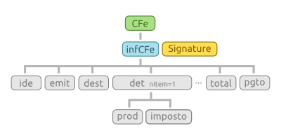
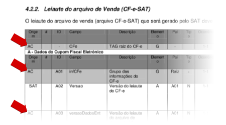

.. _venda-e-cancelamento:

Venda e Cancelamento
====================

.. _anatomia-do-cfe:

Anatomia do CF-e
----------------

O *Cupom Fiscal eletrônico*, CF-e, é um documento fiscal com validade jurídica
que não existe fisicamente, mas apenas de forma eletrônica, em formato `XML`_,
que descreve todos os aspectos práticos de uma operação de venda ou do
cancelamento de uma venda. A figura abaixo ilustra a anatomia de um CF-e de
venda, destacando todos os seus elementos de mais alto nível.

Um documento CF-e que se compare com a ilustração, grosseiramente se traduz para
o seguinte fragmento XML:

.. sourcecode:: xml

    <CFe>
      <infCFe>
        <ide/>
        <emit/>
        <dest/>
        <det nItem="1">
          <prod/>
          <imposto/>
        </det>
        <total/>
        <pgto/>
      </infCFe>
      <Signature/>
    </CFe>

O ponto central da tecnologia SAT-CF-e, do ponto de vista do desenvolvedor do
aplicativo comercial, é o modelo através do qual um CF-e é construído até se
transformar em um documento com validade jurídica.

#. O aplicativo comercial inicia o CF-e construindo a maior parte dos elementos
   a partir dos dados da venda e o envia para o equipamento SAT através da
   função ``EnviarDadosVenda``;

#. O equipamento SAT complementa o CF-e, calculando e incluindo outras
   informações que são de sua responsabilidade e assinando digitalmente o
   documento, e o transmite para a SEFAZ;

#. A SEFAZ valida o documento e o retorna para o equipamento SAT que,
   finalmente, retorna a resposta para o aplicativo comercial.

Para compor um CF-e o desenvolvedor do aplicativo comercial deverá observar a
coluna **Origem** da tabela que descreve os elementos do CF-e nos itens
**4.2.2** (*layout do arquivo de venda*) e **4.2.3** (*layout do arquivo de
cancelamento*). Os elementos onde a coluna **Origem** indicar ``AC`` são os
elementos que o aplicativo comercial deverá incluir no XML. Os elementos
indicados com ``SAT`` são os elementos que o equipamento SAT deverá incluir.

Entidades
---------

No contexto deste projeto as **Entidades** são as classes que são utilizadas
para descrever uma venda ou um cancelamento. A documentação da API contém uma
tabela que relaciona as classes de entidades aos elementos XML descritos na ER
SAT, em :ref:`api-modulo-satcfe-entidades`.

Lidar com API de entidades não é difícil. O exemplo abaixo mostra uma sessão do
interpretador onde é criado uma instância de
:class:`~satcfe.entidades.LocalEntrega` totalmente inválida:

.. sourcecode:: python

    >>> from satcfe.entidades import LocalEntrega
    >>> entrega = LocalEntrega()
    >>> entrega.validar()
    Traceback (most recent call last):
      File "<stdin>", line 1, in <module>
      File "satcfe/entidades.py", line 298, in validar
        'atributos invalidos.'.format(self.__class__.__name__))
    cerberus.cerberus.ValidationError: Entidade "LocalEntrega" possui atributos invalidos.
    >>> entrega.erros
    {'xBairro': 'required field', 'nro': 'required field', 'UF': 'required field', 'xMun': 'required field', 'xLgr': 'required field'}

Para obter o fragmento XML de uma entidade, faça:

.. sourcecode:: python

    >>> entrega = LocalEntrega(
    ...         xLgr='Rua Armando Gulim',
    ...         nro='65',
    ...         xBairro=u'Parque Glória III',
    ...         xMun='Catanduva',
    ...         UF='SP')
    >>> entrega.documento(incluir_xml_decl=False)
    '<entrega><xLgr>Rua Armando Gulim</xLgr><nro>65</nro><xBairro>Parque Gloria III</xBairro><xMun>Catanduva</xMun><UF>SP</UF></entrega>'

.. _criando-um-cfe-de-venda:

Criando um CF-e de Venda
------------------------

Criar um CF-e de venda é simples no que diz respeito à composição dos elementos.
Obviamente, no contexto da aplicação comercial, inúmeras outras complexidades se
apresentam. Mas este exemplo simples é capaz de produzir um XML que poderá ser
enviado para o equipamento SAT.

.. note::

    Equipamentos SAT em desenvolvimento podem requerer que os dados do emitente
    sejam certos dados específicos, bem como o CNPJ que identifica a software
    house que desenvolve a AC. Consulte a documentação técnica do fabricante do
    seu equipamento SAT.

.. sourcecode:: python

    from satcomum import constantes
    from satcfe.entidades import Emitente
    from satcfe.entidades import Destinatario
    from satcfe.entidades import LocalEntrega
    from satcfe.entidades import Detalhamento
    from satcfe.entidades import ProdutoServico
    from satcfe.entidades import Imposto
    from satcfe.entidades import ICMSSN102
    from satcfe.entidades import PISSN
    from satcfe.entidades import COFINSSN
    from satcfe.entidades import MeioPagamento

    cfe = CFeVenda(
            CNPJ='08427847000169',
            signAC=constantes.ASSINATURA_AC_TESTE,
            numeroCaixa=2,
            emitente=Emitente(
                    CNPJ='61099008000141',
                    IE='111111111111'),
            destinatario=Destinatario(
                    CPF='11122233396',
                    xNome=u'João de Teste'),
            entrega=LocalEntrega(
                    xLgr='Rua Armando Gulim',
                    nro='65',
                    xBairro=u'Parque Glória III',
                    xMun='Catanduva',
                    UF='SP'),
            detalhamentos=[
                    Detalhamento(
                            produto=ProdutoServico(
                                    cProd='123456',
                                    xProd='BORRACHA STAEDTLER pvc-free',
                                    CFOP='5102',
                                    uCom='UN',
                                    qCom=Decimal('1.0000'),
                                    vUnCom=Decimal('5.75'),
                                    indRegra='A'),
                            imposto=Imposto(
                                    icms=ICMSSN102(Orig='2', CSOSN='500'),
                                    pis=PISSN(CST='49'),
                                    cofins=COFINSSN(CST='49'))),
                ],
            pagamentos=[
                    MeioPagamento(
                            cMP=constantes.WA03_DINHEIRO,
                            vMP=Decimal('10.00')),
                ])

O XML produzido por este código é um documento CF-e ainda incompleto, que deverá
ser enviado ao equipamento SAT pra que seja completado, assinado e transmitido
para a SEFAZ. Você poderá ver um exemplo do documento XML gerado por esse
código em :ref:`exemplos-xml-do-cfe-de-venda`.

Ao submeter o CF-e ao equipamento SAT, a resposta será uma instância de
:class:`~satcfe.resposta.enviardadosvenda.RespostaEnviarDadosVenda` e a partir
dela você poderá obter o XML do CF-e-SAT assinado e autorizado, obter os dados
para geração do QRCode e outras informações:

.. sourcecode:: python

    >>> resposta = cliente.enviar_dados_venda(cfe)
    >>> resposta.xml()
    u'<?xml version="1.0"?><CFe><infCFe Id="CFe35150761...</Signature></CFe>'

    >>> resposta.qrcode()
    u'35150761099008000141599000026310000100500297|20150709172317|...JI2BCucA=='

    >>> resposta.valorTotalCFe
    Decimal('5.75')

.. _criando-um-cfe-de-cancelamento:

Criando um CF-e de Cancelamento
-------------------------------

Para realizar o cancelamento de um CF-e-SAT de venda, você irá precisar da
chave de acesso do documento a ser cancelado:

.. sourcecode:: python

    from satcomum import constantes
    from satcfe import BibliotecaSAT
    from satcfe import ClienteSATLocal
    from satcfe.entidades import CFeCancelamento

    chave_acesso_venda = ... # obter a chave de acesso do CF-e-SAT de venda

    cfecanc = CFeCancelamento(
            chCanc=chave_acesso_venda,
            CNPJ='08427847000169',
            signAC=contantes.ASSINATURA_AC_TESTE,
            numeroCaixa=2)

    cliente = ClienteSATLocal(BibliotecaSAT('/opt/fabricante/libsat.so'),
            codigo_ativacao='12345678')

    resposta = cliente.cancelar_ultima_venda(cfecanc.chCanc, cfecanc)

Assim como na venda, o cancelamento irá produzir um XML ainda incompleto que
será submetido ao equipamento SAT, que o irá completá-lo, assiná-lo e
transmití-lo à SEFAZ. Veja um exemplo do :ref:`exemplos-xml-do-cfe-de-cancelamento`
e do :ref:`exemplos-xml-do-cfe-sat-cancelamento`.

Se algo der errado durante o cancelamento serão lançadas exceções apropriadas.
Mais detalhes em :ref:`lidando-com-as-respostas` e :ref:`lidando-com-excecoes`.

Para obter o XML da resposta (o CF-e-SAT de cancelamento) ou os dados do
QRcode, use os métodos
:meth:`~satcfe.resposta.cancelarultimavenda.RespostaCancelarUltimaVenda.xml` e
:meth:`~satcfe.resposta.cancelarultimavenda.RespostaCancelarUltimaVenda.qrcode`.

.. include:: references.rst
